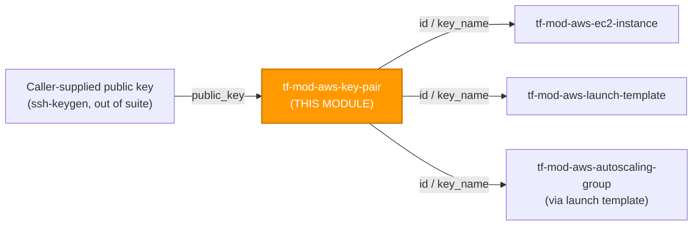
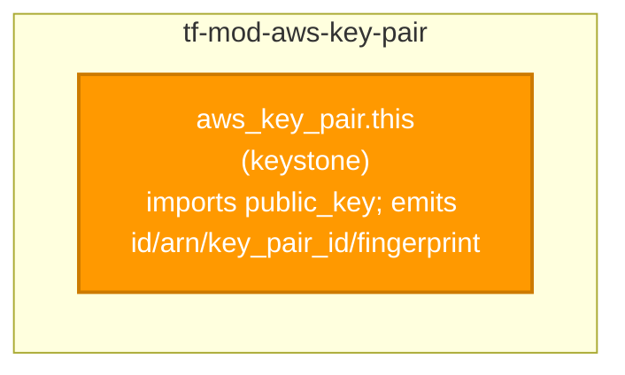

# 🔑 AWS **EC2 Key Pair** Terraform Module

> **Registers a single, caller-supplied SSH public key with AWS (`aws_key_pair`) so it can be named as `key_name` when launching EC2 instances — public-key-only by design, with weak-algorithm (DSA) rejection and the private key never touching the module, AWS, or Terraform state.** Built for the AWS provider **v6.x**.


---

## 🧩 Overview

- 🔑 Registers **one** EC2 key pair — the named public key that EC2 injects into an instance's `authorized_keys` at launch (`aws_instance.key_name` / launch-template `key_name`).
- 🔒 **Public-key-only by design.** The module accepts `public_key` and emits **no secret**. The matching private key is generated and held by the caller — it never enters this module, never goes to AWS, and never lands in Terraform state.
- 🚫 **Weak algorithm rejected.** Variable validation refuses DSA (`ssh-dss`) keys — below the cryptographic baseline and unsupported by EC2. Accepted types are **RSA (2048/4096-bit)** and **ED25519** (ED25519 is not usable by Windows instances).
- 🏷️ **Flexible identity.** Set an explicit `key_name`, a server-generated `key_name_prefix` (collision-free), or neither (Terraform generates a unique name) — all three are mutually validated and **FORCE-NEW**.
- 🔗 Emits `id` (the key name), `arn`, `key_pair_id` (`key-...`), `key_type`, and `fingerprint` for clean wiring into `tf-mod-aws-ec2-instance`, `tf-mod-aws-launch-template`, and `tf-mod-aws-autoscaling-group`.

> 💡 **Why it matters:** An SSH key pair is a credential boundary. Keeping the private key entirely out of state — and refusing weak algorithms at plan time — is the single most important secure default a key-pair module can enforce. The hardened posture is the *default*, not a per-team checklist.

---

## ❤️ Support this project

If these Terraform modules have been helpful to you or your organization, I'd appreciate your support in any of the following ways:

- ⭐ **Star this repository** to help others discover this Terraform module.
- 🤝 **Connect with me on LinkedIn:** [linkedin.com/in/microsoftexpert](https://www.linkedin.com/in/microsoftexpert)
- ☕ **Buy me a coffee:** [buymeacoffee.com/microsoftexpert](https://buymeacoffee.com/microsoftexpert)

Whether it's a star, a professional connection, or a coffee, every gesture helps keep these modules actively maintained and continually improving. Thank you for being part of the community!

---

## 🗺️ Where this fits in the family

`tf-mod-aws-key-pair` is a **standalone identity primitive** — it has no upstream `tf-mod-*` dependency (the public key material is supplied directly by the caller, outside Terraform) and is consumed **by name** (`key_name`) by anything that launches EC2 instances.



This module **consumes** only a caller-supplied public key (no upstream `tf-mod-*`); it **emits** `id` / `key_name` for instance and launch-template wiring — see the [Typical wiring](#-typical-wiring) table.

---

## 🧬 What this module builds

A single `aws_key_pair` resource that imports caller-supplied public-key material — no sub-resources, no dynamic blocks, no data plane.



| Resource | Count | Created when |
|---|---|---|
| `aws_key_pair.this` | 1 | always (keystone — the only resource in this module) |

---

## 📁 Module Structure

```
tf-mod-aws-key-pair/
├── providers.tf # terraform >= 1.12, aws >= 6.0 < 7.0 (no provider{} block)
├── variables.tf # key_name, key_name_prefix, public_key (required), tags
├── main.tf # aws_key_pair.this
├── outputs.tf # id, arn, key_pair_id, key_name, key_type, fingerprint, tags_all
├── README.md
└── SCOPE.md
```

---

## ⚙️ Quick Start

Smallest working call — register a named public key:

```hcl
module "bastion_key" {
  source = "git::https://github.com/microsoftexpert/tf-mod-aws-key-pair?ref=v1.0.0"

  key_name   = "bastion-prod"
  public_key = file("${path.module}/keys/bastion-prod.pub")

  tags = {
    Environment = "prod"
    CostCenter  = "platform"
  }
}
```

Wire it into an instance (`key_name` is the cross-resource reference):

```hcl
module "bastion" {
  source   = "git::https://github.com/microsoftexpert/tf-mod-aws-ec2-instance?ref=v1.0.0"
  key_name = module.bastion_key.id # == key_name
  #... ami, subnet_id, security_group_ids...
}
```

> ⚠️ Pin the source to a tag (`?ref=v1.0.0`) — never a branch.

---

## 🔑 Required IAM Permissions

Least-privilege actions the executing **Terraform identity** needs. This module **imports a caller-supplied public key**, so the create action is `ec2:ImportKeyPair` — **not** `ec2:CreateKeyPair` (which would have AWS *generate* a new private key).

| Action | Required for | Notes |
|---|---|---|
| `ec2:ImportKeyPair` | Register the public key (`apply`) | Core create action. Honors `--tag-specification`, so request-time tagging also needs `ec2:CreateTags`. |
| `ec2:DeleteKeyPair` | De-register the key pair (`destroy`) | Also fires on a FORCE-NEW replacement (delete-then-recreate). |
| `ec2:DescribeKeyPairs` | Read / refresh state (`plan`) | Read-only; **cannot be ARN-scoped** — `Describe*` calls don't support resource-level permissions. |
| `ec2:CreateTags` | `tags` at import time | Paired with `ImportKeyPair` for request-time tagging. |
| `ec2:DeleteTags` | Removing / changing `tags` | Tag updates after creation. |

> **Service-linked roles:** `aws_key_pair` creates **no** service-linked role. No `iam:CreateServiceLinkedRole` is required by this module.
>
> ℹ️ **No `iam:PassRole`** is involved — a key pair is not an IAM principal and passes no role. (PassRole belongs to the *consuming* `tf-mod-aws-ec2-instance` module's instance profile, not here.)

---

## 📋 AWS Prerequisites

- **Service-linked roles:** None required for `aws_key_pair`.
- **Account opt-ins:** None. Registering a public key works in any active Region with no service enablement.
- **A locally generated key pair:** You must already hold an RSA (2048/4096-bit) or ED25519 key pair and supply **only the public half** to `public_key`. The private key stays with the caller. AWS accepts the public key in **OpenSSH format** (`~/.ssh/authorized_keys` form, e.g. `ssh-ed25519 AAAA...`), **base64-encoded DER**, or **RFC 4716** SSH public-key file format.
- **Region constraints:** None. EC2 key pairs are **regional** — a key registered in one Region is not visible in another, and there is **no us-east-1 global-service constraint**. The module inherits the caller's provider Region; it declares no `region` variable. To use the same key in multiple Regions, call the module once per Region (via provider aliases).
- **Windows note:** Windows instances cannot use **ED25519** keys for the password-decrypt flow — use **RSA** for Windows hosts.
- **Service quotas:** Default **5,000 key pairs per Region per account** (adjustable via Service Quotas). Unlikely to bind in practice.

---

## 🔌 Typical wiring

| This module output | Feeds into |
|---|---|
| `id` | `tf-mod-aws-ec2-instance` (`key_name`), `tf-mod-aws-launch-template` (`key_name`), `tf-mod-aws-autoscaling-group` (via launch template) — `id` **equals** the key name. |
| `key_name` | Same consumers as `id`; the explicit name attribute (identical value). |
| `arn` | `tf-mod-aws-iam-policy` resource ARNs / SCP conditions, AWS Config rules keyed on the key-pair ARN. |
| `key_pair_id` | AWS Config / EC2 `DescribeKeyPairs` lookups, drift detection keyed on the stable `key-...` id. |
| `fingerprint` | Out-of-band verification that the registered key matches the caller's local key. |
| `key_type` | Compliance reporting (e.g. assert no RSA-2048 remains). |
| `tags_all` | Governance / audit of effective tags (incl. provider `default_tags`). |

> ℹ️ Most consumers wire **`id` / `key_name`** (the name is what `aws_instance.key_name` expects). The ARN is rarely the cross-resource reference for this resource.

---

## 🧠 Architecture Notes

**ID / ARN formats**

- `id` — **the key pair name** (equals `key_name`). This is the value you pass to `aws_instance.key_name` / a launch template's `key_name`. It is *not* a `key-...` id.
- `arn` — `arn:aws:ec2:<region>:<account-id>:key-pair/<key-name>`. Used by IAM/SCP conditions and AWS Config rules.
- `key_pair_id` — the separate, stable identifier `key-0123456789abcdef0`, returned by `DescribeKeyPairs` and used by some APIs / Config rules as a name-independent reference.
- `fingerprint` — the MD5 public-key fingerprint per section 4 of RFC 4716; verify it matches your local key.

**Force-new / immutable fields** — changing any of these **destroys and recreates** the key pair (a new `key-...` id), which **de-registers it from instances launched with it** (already-running instances keep the injected key, but the named key pair they reference is gone):

- `key_name`
- `key_name_prefix`
- `public_key`

There are **no in-place-updatable** structural fields and **no `timeouts` block** on this resource — only `tags` change in place.

**`tags` ↔ `tags_all` ↔ `default_tags`** — `var.tags` flows to `aws_key_pair.this.tags`. The computed `tags_all` output is the merge of resource tags over the provider's `default_tags`; **resource tags win on key conflict.** `default_tags` is the caller's provider-block concern and is never set inside this module.

**Eventual consistency** — a freshly imported key pair is generally usable immediately, but a dependent `aws_instance` created in the same plan should reference `module.key.id` so Terraform orders the import before the launch.

**Import-drift gotcha** — the **AWS API does not return the public-key material** in `DescribeKeyPairs`. If you `terraform import` a pre-existing key pair, the provider cannot read back `public_key` and will plan to **replace** the key pair on the next apply. There is no supported workaround; prefer creating the key pair through this module rather than importing one.

**Destroy ordering** — destroy any consuming `aws_instance` (or at least stop referencing the key) before destroying the key pair to avoid a dependency error; the resource graph handles this when the instance is in the same configuration and references `module.key.id`.

**Region** — key pairs are **regional**, not global; there is **no us-east-1 constraint**. The module inherits the provider Region.

---

## 📚 Example Library (copy-paste)

<details>
<summary><b>1 · Minimal — named key from a file</b></summary>

```hcl
module "key" {
  source = "git::https://github.com/microsoftexpert/tf-mod-aws-key-pair?ref=v1.0.0"

  key_name   = "app-prod"
  public_key = file("${path.module}/keys/app-prod.pub")
}
```
</details>

<details>
<summary><b>2 · With tags</b></summary>

```hcl
module "key" {
  source = "git::https://github.com/microsoftexpert/tf-mod-aws-key-pair?ref=v1.0.0"

  key_name   = "app-prod"
  public_key = file("${path.module}/keys/app-prod.pub")

  tags = {
    Environment = "prod"
    Application = "payments-api"
    Owner       = "platform-team"
  }
}
```

> `tags` merge with provider `default_tags`; resource tags win on key conflict. Inspect the effective set via the `tags_all` output.
</details>

<details>
<summary><b>3 · Inline OpenSSH public key</b></summary>

```hcl
module "key" {
  source = "git::https://github.com/microsoftexpert/tf-mod-aws-key-pair?ref=v1.0.0"

  key_name   = "ops-ed25519"
  public_key = "ssh-ed25519 AAAAC3NzaC1lZDI1NTE5AAAAID...example ops@casey"
}
```
</details>

<details>
<summary><b>4 · ED25519 key (modern default; not for Windows)</b></summary>

```hcl
# Generate locally: ssh-keygen -t ed25519 -f./keys/linux-fleet
module "key" {
  source = "git::https://github.com/microsoftexpert/tf-mod-aws-key-pair?ref=v1.0.0"

  key_name   = "linux-fleet"
  public_key = file("${path.module}/keys/linux-fleet.pub")
}
```

> AWS infers `key_type = "ed25519"` from the material. ED25519 keys **cannot** be used by Windows instances — use RSA for Windows hosts (Example 5).
</details>

<details>
<summary><b>5 · RSA 4096-bit key (Windows-compatible)</b></summary>

```hcl
# Generate locally: ssh-keygen -t rsa -b 4096 -f./keys/win-fleet
module "key" {
  source = "git::https://github.com/microsoftexpert/tf-mod-aws-key-pair?ref=v1.0.0"

  key_name   = "win-fleet"
  public_key = file("${path.module}/keys/win-fleet.pub")
}
```

> RSA 2048/4096 is required for the Windows password-decrypt flow. The module rejects DSA (`ssh-dss`) keys at plan time.
</details>

<details>
<summary><b>6 · Collision-free naming with <code>key_name_prefix</code></b></summary>

```hcl
module "key" {
  source = "git::https://github.com/microsoftexpert/tf-mod-aws-key-pair?ref=v1.0.0"

  key_name_prefix = "ephemeral-ci-" # AWS appends a unique suffix
  public_key      = file("${path.module}/keys/ci.pub")
}
```

> Use a prefix when many key pairs must coexist without name collisions (e.g. per-pipeline-run keys). `key_name` and `key_name_prefix` are **mutually exclusive** — the module rejects setting both.
</details>

<details>
<summary><b>7 · Terraform-generated name (set neither)</b></summary>

```hcl
module "key" {
  source = "git::https://github.com/microsoftexpert/tf-mod-aws-key-pair?ref=v1.0.0"

  public_key = file("${path.module}/keys/scratch.pub")
}
```

> With both `key_name` and `key_name_prefix` null, Terraform generates a unique name. Read it back from `module.key.id` / `module.key.key_name`.
</details>

<details>
<summary><b>8 · Read the public key from an SSM Parameter / data source</b></summary>

```hcl
data "aws_ssm_parameter" "ops_pubkey" {
  name = "/casey/keys/ops-public"
}

module "key" {
  source = "git::https://github.com/microsoftexpert/tf-mod-aws-key-pair?ref=v1.0.0"

  key_name   = "ops"
  public_key = data.aws_ssm_parameter.ops_pubkey.value
}
```

> Store **only the public key** in SSM. Never put the private key in a parameter, secret, or Terraform variable consumed by this module.
</details>

<details>
<summary><b>9 · Verify the registered key matches your local key</b></summary>

```hcl
module "key" {
  source = "git::https://github.com/microsoftexpert/tf-mod-aws-key-pair?ref=v1.0.0"

  key_name   = "audited"
  public_key = file("${path.module}/keys/audited.pub")
}

output "key_fingerprint" {
  value = module.key.fingerprint # compare against your local key's RFC-4716 MD5 fingerprint
}
```
</details>

<details>
<summary><b>10 · Customer-managed KMS — N/A for this resource</b></summary>

An EC2 key pair stores **only a public key** — there is no private material, no data plane, and **no encryption-at-rest surface**. This module therefore exposes **no `kms_key_arn` variable**: there is nothing to encrypt with a CMK. The secure posture here is **structural** — public-key-only and DSA rejection (see **Design Principles**).

```hcl
# No kms_key_arn here — intentionally. The customer-managed-KMS pattern
# applies to data-bearing modules (tf-mod-aws-s3-bucket, tf-mod-aws-rds,
# tf-mod-aws-ebs-volume), not to a public-key registration.
module "key" {
  source     = "git::https://github.com/microsoftexpert/tf-mod-aws-key-pair?ref=v1.0.0"
  key_name   = "app"
  public_key = file("${path.module}/keys/app.pub")
}
```
</details>

<details>
<summary><b>11 · Secure-by-default opt-out — generating the key in Terraform (EXCEPTION — avoid)</b></summary>

The secure default is **the private key never enters Terraform state.** Generating a key with the `tls` provider writes the **private key into state in plaintext** — a deliberate, audited exception you should avoid for any PII-adjacent or long-lived key.

```hcl
# ⚠️ EXCEPTION: tls_private_key.private_key_openssh is stored UNENCRYPTED in state.
resource "tls_private_key" "ephemeral" {
  algorithm = "ED25519"
}

module "key" {
  source = "git::https://github.com/microsoftexpert/tf-mod-aws-key-pair?ref=v1.0.0"

  key_name   = "throwaway-ephemeral"
  public_key = tls_private_key.ephemeral.public_key_openssh
  tags       = { Exception = "tls-generated-key-in-state-approved" }
}
```

> Prefer generating the key **outside** Terraform (`ssh-keygen`) and supplying only the public half. There is **no DSA opt-out** — the `ssh-dss` rejection is non-negotiable.
</details>

<details>
<summary><b>12 · Cross-module wiring — key pair → EC2 instance</b></summary>

```hcl
module "bastion_key" {
  source = "git::https://github.com/microsoftexpert/tf-mod-aws-key-pair?ref=v1.0.0"

  key_name   = "bastion-prod"
  public_key = file("${path.module}/keys/bastion-prod.pub")
  tags       = { Environment = "prod" }
}

module "bastion" {
  source   = "git::https://github.com/microsoftexpert/tf-mod-aws-ec2-instance?ref=v1.0.0"
  key_name = module.bastion_key.id # the key pair name
  #... ami, subnet_id (tf-mod-aws-vpc), security_group_ids (tf-mod-aws-security-group)...
}
```

> 💡 At the preferred keyless path is **SSM Session Manager** — a key pair is the break-glass fallback, not the primary access method.
</details>

<details>
<summary><b>13 · Cross-module wiring — key pair → launch template → ASG</b></summary>

```hcl
module "fleet_key" {
  source = "git::https://github.com/microsoftexpert/tf-mod-aws-key-pair?ref=v1.0.0"

  key_name   = "web-fleet"
  public_key = file("${path.module}/keys/web-fleet.pub")
}

module "web_lt" {
  source   = "git::https://github.com/microsoftexpert/tf-mod-aws-launch-template?ref=v1.0.0"
  key_name = module.fleet_key.id
  #... image_id, instance_type...
}
```
</details>

<details>
<summary><b>14 · Multi-Region — register the same key in two Regions (provider aliases)</b></summary>

```hcl
provider "aws" {
  alias  = "use1"
  region = "us-east-1"
}
provider "aws" {
  alias  = "usw2"
  region = "us-west-2"
}

module "key_use1" {
  source     = "git::https://github.com/microsoftexpert/tf-mod-aws-key-pair?ref=v1.0.0"
  providers  = { aws = aws.use1 }
  key_name   = "ops"
  public_key = file("${path.module}/keys/ops.pub")
}

module "key_usw2" {
  source     = "git::https://github.com/microsoftexpert/tf-mod-aws-key-pair?ref=v1.0.0"
  providers  = { aws = aws.usw2 }
  key_name   = "ops"
  public_key = file("${path.module}/keys/ops.pub")
}
```

> Key pairs are **regional** — register the public key once per Region you launch instances in.
</details>

---

## 📥 Inputs (high-level)

| Name | Type | Default | Description |
|---|---|---|---|
| `public_key` | `string` | — *(required)* | Public key material to register. **FORCE-NEW.** OpenSSH / base64-DER / RFC 4716 formats. RSA or ED25519 only — **DSA rejected**. Supply the public key *only*. |
| `key_name` | `string` | `null` | Explicit key pair name (the primary identity). **FORCE-NEW.** Max 255 chars. Mutually exclusive with `key_name_prefix`. |
| `key_name_prefix` | `string` | `null` | Server-generated unique name from this prefix. **FORCE-NEW.** Mutually exclusive with `key_name`. |
| `tags` | `map(string)` | `{}` | Tags; merge with provider `default_tags`, resource tags win on conflict. |

> ℹ️ full schema lives in `variables.tf`. There is **no `timeouts` block** on this resource.

---

## 🧾 Outputs

| Output | Description |
|---|---|
| `id` | The key pair **name** (equals `key_name`) — the value wired into `aws_instance.key_name`. |
| `arn` | Key pair ARN (`arn:aws:ec2:<region>:<account>:key-pair/<key-name>`). |
| `key_pair_id` | Stable key pair id (`key-...`) used by `DescribeKeyPairs` / Config rules. |
| `key_name` | The key pair name (identical to `id`). |
| `key_type` | The type AWS inferred from the material (`"rsa"` or `"ed25519"`). |
| `fingerprint` | RFC 4716 §4 MD5 public-key fingerprint — verify against your local key. |
| `tags_all` | All tags incl. inherited `default_tags` (resource tags win). |

> No output exposes any private material — by design there is **no `sensitive` output**, because the module never holds a secret.

---

## 🧱 Design Principles

A key pair has **no encryption-at-rest, no public-access-block, and no data-plane logging surface** — so the secure-by-default posture here is **structural and cryptographic-baseline**, not CMK-based. Each default below is the safe choice; the opt-out (where one exists) is explicit.

| Posture | Default | Opt-out |
|---|---|---|
| **Public-key-only** (no secret in module/state) | `public_key` is the only material the module accepts | **None** — there is no path to put a private key through this module. (Generating a key in Terraform writes the private key to state — an *external* anti-pattern, Example 11.) |
| **DSA rejected** (cryptographic baseline) | `validation {}` blocks `ssh-dss` | **None** — non-negotiable; use RSA or ED25519. |
| **Identity mutual-exclusion** | `key_name` ⇎ `key_name_prefix` enforced via `validation {}` | None — prevents the provider's "both set" rejection by design. |
| **Encryption at rest** | N/A — no encryption surface | None (encrypt the workload behind the key, not the key). |

Additional principles:

- **Single resource named `this`** — exactly four files; no `provider {}` block; no credential or `region` variable.
- **FORCE-NEW fields flagged** in every variable description (`key_name`, `key_name_prefix`, `public_key`) so callers know which changes recreate the key pair (and de-register it from launched instances).
- **Primary outputs `id` + `arn`**, plus `key_pair_id` / `key_type` / `fingerprint` (the real operational references) and `tags_all`.

---

## 🚀 Runbook

```powershell
cd C:\GitHubCode\newawsmodules\tf-mod-aws-key-pair

terraform init -backend=false
terraform validate
terraform fmt -check
```

> `plan` / `apply` require valid AWS credentials (profile / SSO / OIDC) and a configured provider Region. This module declares only `required_providers` and inherits the caller's provider.
>
> ⚠️ Pin the source with `?ref=v1.0.0`, never a branch.

---

## 🔍 Troubleshooting

| Symptom | Likely cause | Fix |
|---|---|---|
| `terraform import` then a forced **replace** on next apply | AWS `DescribeKeyPairs` does **not** return `public_key`, so the provider can't read it back | Expected — there is no workaround. Prefer creating the key pair through this module instead of importing. |
| `error: DSA (ssh-dss) keys are not permitted` | A DSA public key was supplied | Generate an RSA (2048/4096) or ED25519 key; DSA is unsupported by EC2 and below the baseline. |
| `Set either key_name or key_name_prefix, not both` | Both identity variables set | Set exactly one (or neither, to let Terraform generate the name). |
| Windows instance won't decrypt its password | The key pair is ED25519 | Windows requires RSA — register an RSA key for Windows hosts. |
| Key pair recreated on a benign-looking change | Edited a FORCE-NEW field (`key_name`, `key_name_prefix`, `public_key`) | Expected — those replace the key pair and de-register it from launched instances. Plan the cutover. |
| `InvalidKeyPair.NotFound` when launching an instance | Key pair is in a **different Region** than the instance | Key pairs are regional — register the key in the instance's Region (Example 14). |
| Tag drift on every plan | Same key in both provider `default_tags` and module `tags` | Resource tags win — remove the duplicate from one side; inspect `tags_all`. |
| `apply` fails `UnauthorizedOperation` / `AccessDenied` | Missing IAM action (e.g. `ec2:ImportKeyPair`, `ec2:CreateTags`) | Grant the least-privilege action from **Required IAM Permissions**; don't broaden to `*`. |
| `public_key must not be empty` | `public_key` blank / whitespace | Supply real public-key material — the variable is required. |

---

## 🔗 Related Docs

- [Terraform `aws_key_pair` resource](https://registry.terraform.io/providers/hashicorp/aws/latest/docs/resources/key_pair)
- [Terraform `aws_key_pair` data source](https://registry.terraform.io/providers/hashicorp/aws/latest/docs/data-sources/key_pair)
- [AWS — Amazon EC2 key pairs and Amazon EC2 instances](https://docs.aws.amazon.com/AWSEC2/latest/UserGuide/ec2-key-pairs.html)
- [AWS — `ImportKeyPair` API](https://docs.aws.amazon.com/AWSEC2/latest/APIReference/API_ImportKeyPair.html)
- Sibling modules: `tf-mod-aws-ec2-instance`, `tf-mod-aws-launch-template`, `tf-mod-aws-autoscaling-group`

---

> 🧡 *"Infrastructure as Code should be standardized, consistent, and secure."*
